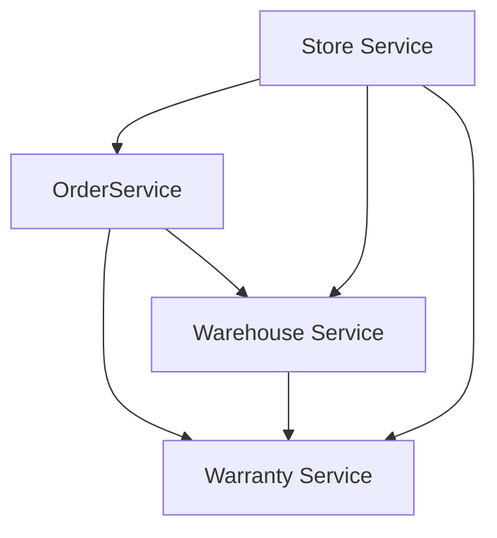

# Microservices

## Состав

* [Store Service](store-service/README.md)
* [Order Service](order-service/README.md)
* [Warehouse Service](warehouse-service/README.md)
* [Warranty Service](warranty-service/README.md)

## Взаимодействие сервисов



## Общая конфигурация

Все сервисы имеют health-чеки:

```shell
curl http://localhost:8480/manage/health --user management:passwd | jq
{
  "status": "UP",
  "components": {
    "db": {
      "status": "UP",
      "details": {
        "database": "PostgreSQL",
        "validationQuery": "isValid()"
      }
    },
    "ping": {
      "status": "UP"
    }
  }
}
```

Для каждого модуля отдается OpenAPI спецификация в формате json, для просмотра можно использовать Swagger UI

```http request
http://{{baseUrl}}/swagger-ui.html
```

## Сборка и запуск

```shell
# установить gradle wrapper
$ ./gradlew wrapper

# сборка проектов
$ ./gradlew clean build
```

Запуск проектов локально, PostgreSQL в контейнере:

```shell
$ docker compose up -d postgres

$ ./gradlew store-service:bootRun
```

Запуск проектов через Docker Compose:

```shell
$ docker compose build

$ dcoker compose up -d
```

## Авторизация

```http request
GET http://localhost:8080/auth/realms/auth-realm/.well-known/openid-configuration
```

`Client` -> `Create` ->
`Client ID: store-service` ->
`Client Protocol: OpenID Connect` ->
`Access Type: confidential` ->
`Credentials`

## Тестирование

Для проверки работоспособности системы используются скрипты Postman. В папке [postman](postman)
содержится [коллекция запросов](postman/collection.json) к серверу и два enviroment'а:

* [local](postman/environment.json);

Для автоматизированной проверки используется [GitHub Actions](.github/workflows/main.yml), CI/CD содержит шаги:

* сборка;
* запуск в docker compose;
* прогон скриптов postman через newman.