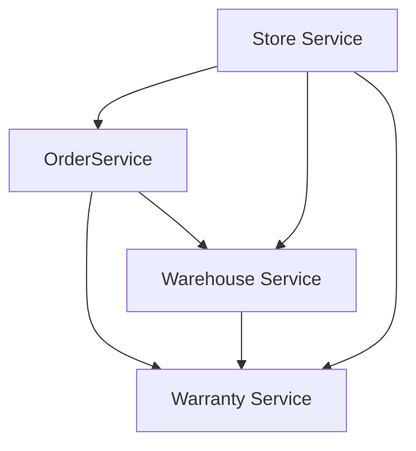

# Microservices

## Состав

* [Store Service](store-service/README.md)
* [Order Service](order-service/README.md)
* [Warehouse Service](warehouse-service/README.md)
* [Warranty Service](warranty-service/README.md)

## Взаимодействие сервисов



## Общая конфигурация

Все сервисы имеют health-чеки:

```shell script
curl https://warranty-service-app.herokuapp.com/manage/health --user management:passwd | jq
{
  "status": "UP",
  "components": {
    "db": {
      "status": "UP",
      "details": {
        "database": "PostgreSQL",
        "validationQuery": "isValid()"
      }
    },
    "ping": {
      "status": "UP"
    }
  }
}
```

Для каждого модуля отдается OpenAPI спецификация в формате json, для просмотра можно использовать Swagger UI

```http request
http://{{baseUrl}}/swagger-ui.html
```

## Сборка и запуск

```shell
# установить gradle wrapper
./gradlew wrapper

# сборка проектов
./gradlew clean build
```

Запуск проектов локально, PostgreSQL в контейнере:

```shell
docker compose up -d postgres
./gradlew store-service:bootRun
```

Запуск проектов через Docker Compose:

```shell
docker compose build
dcoker compose up -d
```

## Используемые системы

### Service Discovery

Для Service Discovery используется Consul. Кластер развернут из трех машин в режиме server, на главной (
consul-server-bootstrap) открыты порты:

* 8400 – взаимодействие через командную строку;
* 8500 – HTTP API;
* 8600/udp – DNS.

Внутреннее взаимодействие выполняется через порт 8301: взаимодействие по протоколу gossip.

Веб интерфейс доступен по адресу `http://localhost:8500/ui/`

Приложение при старте регистрируется в Consul, регистрирует свои health-чеки. Consul _самостоятельно_
проверяет состояние сервисов.

## Тестирование

Для проверки работоспособности системы используются скрипты Postman. В папке [postman](postman)
содержится [коллекция запросов](postman/postman-collection.json) к серверу и два enviroment'а:

* [local](postman/postman-local-environment.json);
* [heroku](postman/postman-heroku-environment.json).

Для автоматизированной проверки используется [GitHub Actions](.github/workflows/main.yml), CI/CD содержит шаги:

* сборка;
* деплой _каждого_ приложения на Heroku;
* прогон скриптов postman через newman для enviroment'а heroku.