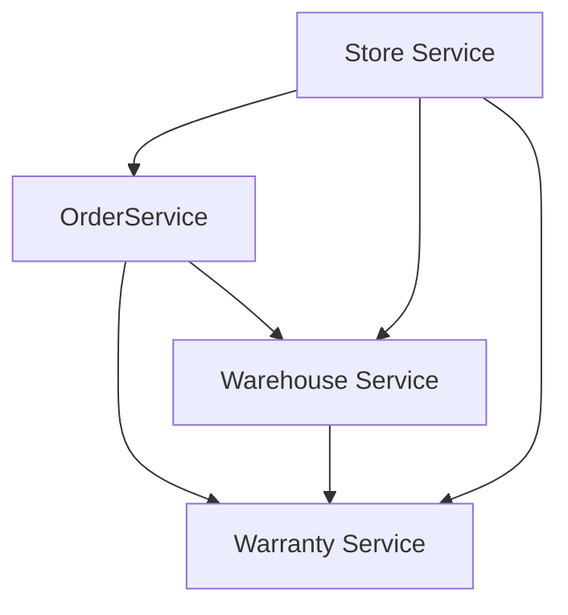

# Microservices

[](https://github.com/Romanow/micro-services-v2/actions/workflows/main.yml)
[](https://github.com/pre-commit/pre-commit)

## Состав

* [Store Service](store-service/README.md)
* [Order Service](order-service/README.md)
* [Warehouse Service](warehouse-service/README.md)
* [Warranty Service](warranty-service/README.md)

## Взаимодействие сервисов



## Сборка и запуск

### Запуск в Docker Compose

```shell
# build services
$ ./gradlew clean build

# build docker images
$ docker compose build

# run images
$ docker compose up -d
```

## Настройка Auth0

1. Регистрируемся на [Auth0](https://auth0.com).
2. Создаем приложение: `Applications` -> `Create Application`: `Native`, заходим в созданное приложение и
   копируем `Client ID` и `Client Secret`.
3. Переходим в `Advanced Settings` -> `Grant Types`: только `Password` (Resource Owner Password Flow).
4. Переходим в `API` -> `Create API`:
    * Name: `Cinema Aggregator Service`;
    * Identifier: `http://store.romanow-alex.ru`;
    * Signing Algorithm: RS256.
5. Настраиваем хранилище паролей: `Settings` -> `Tenant Settings` -> `API Authorization Settings`:
    * Default Audience: `http://store.romanow-alex.ru`;
    * Default Directory: `Username-Password-Authentication`.
6. Создаем тестового пользователя: `User Management` -> `Users` -> `Create User`:
    * Email: `ronin@romanow-alex.ru`;
    * Password: `Qwerty123`;
    * Connection: `Username-Password-Authentication`.

После настройки у вас должен успешно выполняться запрос на проверку получение токена (подставить свои настройки):

```shell
curl --location --request POST 'https://romanowalex.eu.auth0.com/oauth/token' \
  --header 'Content-Type: application/x-www-form-urlencoded' \
  --data-urlencode 'grant_type=password' \
  --data-urlencode 'username=ronin@romanow-alex.ru' \
  --data-urlencode 'password=Qwerty123' \
  --data-urlencode 'scope=openid' \
  --data-urlencode 'client_id=<Client ID>' \
  --data-urlencode 'client_secret=<Client Secret>'
```

В ответ получаем токен:

```json
{
  "access_token": "...",
  "id_token": "...",
  "scope": "openid profile email ...",
  "expires_in": 86400,
  "token_type": "Bearer"
}
```

## Нагрузочное тестирование

```shell
$ brew install k6

$ k6 run \
    --out influxdb=http://localhost:8086/k6 \
    -e USERNAME=ronin@romanow-alex.ru \
    -e PASSWORD=Qwerty123 \
    -e CLIENT_ID=pXrawhpoDM63b82A7fkiLvRIH81wgmH9 \
    -e CLIENT_SECRET=LzQSxUOE2dmAUdgstWke4ngXUeZNLVczvSid7ZVV8HTegCRbOxchQtJ_23EuZ9_V \
    k6.js
```

## Ссылки

1. [10 антипаттернов деплоя в Kubernetes: распространенные практики, для которых есть другие решения](https://habr.com/ru/company/mailru/blog/529152/)
2. [How do you rollback deployments in Kubernetes?](https://learnk8s.io/kubernetes-rollbacks)
