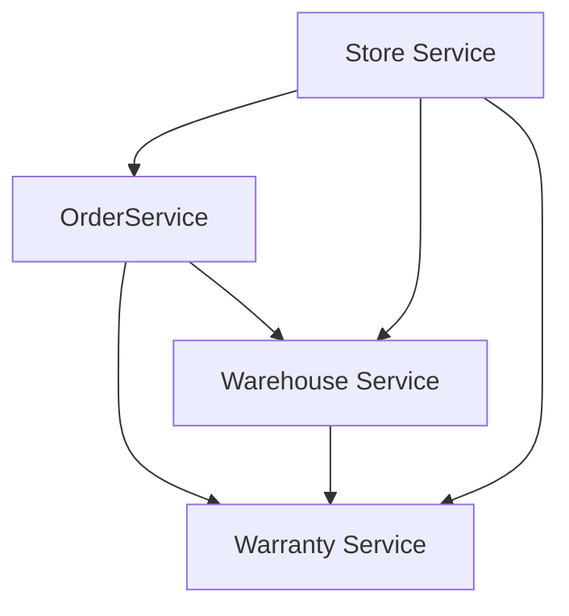

# Microservices

## Состав

* [Store Service](store-service/README.md)
* [Order Service](order-service/README.md)
* [Warehouse Service](warehouse-service/README.md)
* [Warranty Service](warranty-service/README.md)

## Взаимодействие сервисов



## Сборка и запуск

### Запуск в Docker Compose

```shell
$ ./gradlew clean build

$ docker compose build

$ dcoker compose up -d

$ docker compose logs -f
```

### Запуск локального кластера k8s

```shell
# create local cluster
$ kind create cluster --config kind.yml

# configure ingress
$ kubectl apply -f https://raw.githubusercontent.com/kubernetes/ingress-nginx/main/deploy/static/provider/kind/deploy.yaml

# если требуется загрузить локальный образ в кластер
$ kind load docker-image <image-name>

$ cd k8s
$ helm install postgres postgres-chart/

$ helm install services services-chart/ \
      --set store.domain=local \
      --set order.domain=local \
      --set warehouse.domain=local \
      --set warranty.domain=local
      
$ sudo tee -a /etc/hosts > /dev/null <<EOT
127.0.0.1    store.local
127.0.0.1    order.local
127.0.0.1    warehouse.local
127.0.0.1    warranty.local
127.0.0.1    grafana.local
127.0.0.1    jaeger.local
127.0.0.1    kibana.local
EOT

$ cd ../postman
$ newman run -e kind-environment.json --folder=Store\ service  collection.json
```

#### Grafana + Prometheus

```shell
$ helm upgrade monitoring monitoring-chart --set grafana.domain=local
```

Открыть в браузере [http://grafana.local](http://grafana.local).

##### Dashboard

Импортировать Grafana dashboards: `Create` -> `Import` -> `Import via grafana.com`.

* Node Exporter – [12486](https://grafana.com/grafana/dashboards/12486-node-exporter-full/)
* Spring Boot – [10280](https://grafana.com/grafana/dashboards/10280-microservices-spring-boot-2-1/)

Другие доски доступны на [Grafana Labs](https://grafana.com/grafana/dashboards/).

##### Alerting

## Alerting

* Создать бота: в телеграмм находим `@BotFather`, вызываем `/newbot`:
    * name: _k8s_monitoring_
    * id: _k8s_monitoring_bot_
* Создать канал _K8S Monitoring_, добавить `@k8s_monitoring_bot` как администратора. Отправить хотя бы одно сообщение в
  группу.
* После этого через Telegram API получить chart ID:
  ```http request
  GET https://api.telegram.org/bot<token>/getUpdates
  ```
* Создать Notification Channel: `Grafana` -> `Alerting` -> `Notification Channels` -> `Telegram Bot`.
* Создать новый dashboard:
    * Title: Request Count
    * Panel: `Query: sum(irate(http_server_requests_seconds_count{application="store-service"}[5m]))`
    * Alerting:
        * Condition: `Evaluate every: 10s for 0, when avg() of query(A, 10s, now) is above 10`
        * Send to: `Telegram bot`, message: `Too many requests`

#### ELK Stack

```shell
$ helm upgrade elasticsearch elasticsearch-chart

$ helm upgrade logging logging-chart --set kibana.domain=local
```

Открыть в браузере [http://kibana.local](http://kibana.local).

#### Jaeger

```shell
# для работы требуется ElasticSearch
$ helm upgrade jaeger jaeger-chart --set domain=local
```

Открыть в браузере [http://jaeger.local](http://jaeger.local).

## Настройка Auth0

1. Регистрируемся на [Auth0](https://auth0.com).
2. Создаем приложение: `Applications` -> `Create Application`: `Native`, заходим в созданное приложение и
   копируем `Client ID` и `Client Secret`.
3. Переходим в `Advanced Settings` -> `Grant Types`: только `Password` (Resource Owner Password Flow).
4. Переходим в `API` -> `Create API`:
    * Name: `Cinema Aggregator Service`;
    * Identifier: `http://store-service.romanow-alex.ru`;
    * Signing Algorithm: RS256.
5. Настраиваем хранилище паролей: `Settings` -> `Tenant Settings` -> `API Authorization Settings`:
    * Default Audience: `http://store-service.romanow-alex.ru`;
    * Default Directory: `Username-Password-Authentication`.
6. Создаем тестового пользователя: `User Management` -> `Users` -> `Create User`:
    * Email: `ronin@romanow-alex.ru`;
    * Password: `Qwerty123`;
    * Connection: `Username-Password-Authentication`.

После настройки у вас должен успешно выполняться запрос на проверку получение токена (подставить свои настройки):

```shell
curl --location --request POST 'https://romanowalex.eu.auth0.com/oauth/token' \
  --header 'Content-Type: application/x-www-form-urlencoded' \
  --data-urlencode 'grant_type=password' \
  --data-urlencode 'username=ronin@romanow-alex.ru' \
  --data-urlencode 'password=Qwerty123' \
  --data-urlencode 'scope=openid' \
  --data-urlencode 'client_id=<Client ID>' \
  --data-urlencode 'client_secret=<Client Secret>'
```

В ответ получаем токен:

```json
{
  "access_token": "...",
  "id_token": "...",
  "scope": "openid profile email ...",
  "expires_in": 86400,
  "token_type": "Bearer"
}
```

## Нагрузочное тестирование

```shell
$ brew install k6

$ k6 run \
    --out influxdb=http://localhost:8086/k6 \
    -e USERNAME=ronin@romanow-alex.ru \
    -e PASSWORD=Qwerty123 \
    -e CLIENT_ID=pXrawhpoDM63b82A7fkiLvRIH81wgmH9 \
    -e CLIENT_SECRET=LzQSxUOE2dmAUdgstWke4ngXUeZNLVczvSid7ZVV8HTegCRbOxchQtJ_23EuZ9_V \
    k6-load.js
```

## Ссылки

1. [10 антипаттернов деплоя в Kubernetes: распространенные практики, для которых есть другие решения](https://habr.com/ru/company/mailru/blog/529152/)
2. [How do you rollback deployments in Kubernetes?](https://learnk8s.io/kubernetes-rollbacks)