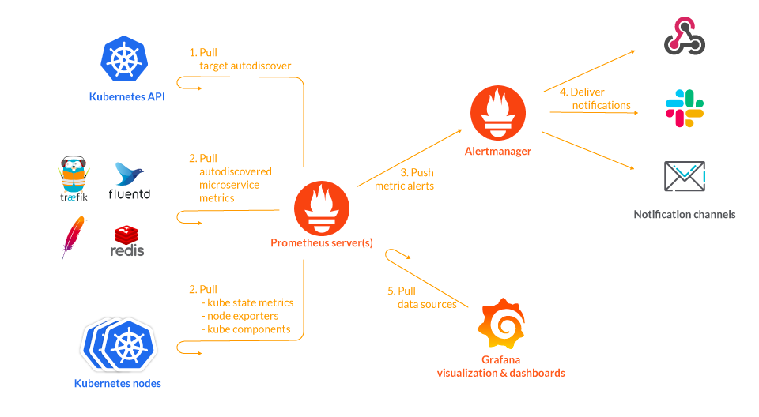
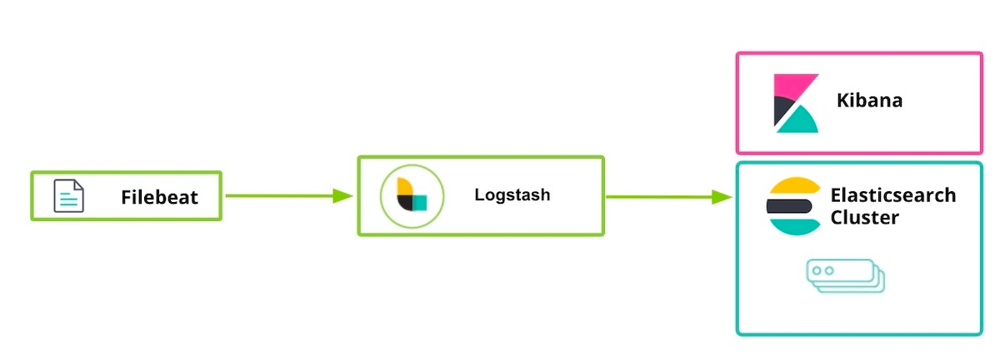
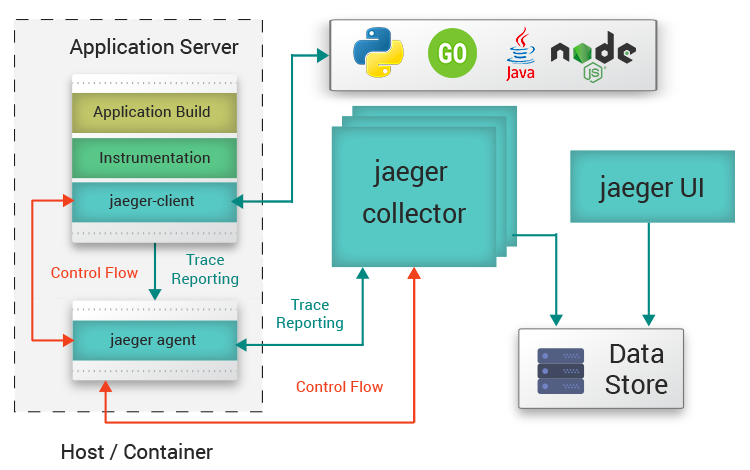

# Deploy microservices to k8s

Бдуем использовать managed kubernetes on DigitalOcean. Развертывание с
помощью [terraform](https://github.com/Romanow/ansible-kubernetes):

```shell
# Устанавливаем Elasticsearch (нужен для Jaeger и ELK)
helm install elasticsearch elasticsearch-chart/

# Устанавливаем монитоинг Prometheus, Grafana и NodeExporter
helm install monitoring monitoring-chart/

# Устанавливаем ELK stack (ElasticSearch установлен выше)
helm install logging logging-chart/

# Устанавливаем Jaeger
helm install logging logging-chart/

# Устанавливаем базу данных и сервисы
helm install services services-chart/
```

## Prometheus & Grafana

Адрес [Grafana](https://grafana.romanow-alex.ru/), credentials: `admin:admin`.

Prometheus хранит данные как Time Series (временные ряды): потоки значений с отметкой времени, приндалежащих одной и той
же метрике и набору labels.



Prometheus сам обращается к сервисам и забирает метрики (scrape), опрашиваемые сервисы описаны в блоке `scrape`
фалйа [prometheus.ym](monitoring-chart/charts/prometheus/config/prometheus.yml):

```
scrape_configs:
  ...
  
  - job_name: 'kubernetes-pods'
    kubernetes_sd_configs:
      - role: pod
    basic_auth:
      username: management
      password: passwd
    relabel_configs:
      - source_labels: [ __meta_kubernetes_pod_annotation_prometheus_io_scrape ]
        action: keep
        regex: true
      - source_labels: [ __meta_kubernetes_pod_label_app_kubernetes_io_component ]
        action: keep
        regex: 'spring'
      - source_labels: [ __meta_kubernetes_pod_name ]
        action: replace
        target_label: kubernetes_pod_name
      - source_labels: [ __meta_kubernetes_pod_annotation_prometheus_io_path ]
        action: replace
        target_label: __metrics_path__
```

Prometheus опрашивает поды с `label: app.kubernetes.io/component: spring` и получает метрики (можно
запросить `curl --user management:passwd http://store.romanow-alex.ru/manage/prometheus`):

```yaml
# TYPE http_server_requests_seconds summary
# HELP http_server_requests_seconds  
http_server_requests_seconds_count{application="store-service",exception="None",method="GET",outcome="CLIENT_ERROR",status="401",uri="root"} 1.0
http_server_requests_seconds_sum{application="store-service",exception="None",method="GET",outcome="CLIENT_ERROR",status="401",uri="root"} 0.003124419
http_server_requests_seconds_count{application="store-service",exception="None",method="GET",outcome="SUCCESS",status="200",uri="/manage/prometheus"} 38.0
http_server_requests_seconds_sum{application="store-service",exception="None",method="GET",outcome="SUCCESS",status="200",uri="/manage/prometheus"} 8.092993196
# TYPE logback_events counter
# HELP logback_events Number of error level events that made it to the logs
logback_events_total{application="store-service",level="info"} 32.0
logback_events_total{application="store-service",level="trace"} 0.0
logback_events_total{application="store-service",level="warn"} 1.0
logback_events_total{application="store-service",level="error"} 0.0
logback_events_total{application="store-service",level="debug"} 78.0

...

# TYPE jdbc_connections_max gauge
# HELP jdbc_connections_max Maximum number of active connections that can be allocated at the same time.
jdbc_connections_max{application="store-service",name="dataSource"} 10.0
# EOF
```

Каждая метрика представляет из себя название, labels и значение:

```
# <metric name>{<label name>=<label value>, ...} <value>

# TYPE logback_events counter
# HELP logback_events Number of error level events that made it to the logs
logback_events_total{application="store-service",level="info"} 32.0
```

`HELP` задает подсказку `TYPE` задает тип счетчика:

* `counter` (счетчик) – монотонно возрастающая метрика (например, суммарное количество запросов);
* `gauge` (измерение) – метрика, которая может идти вверх или вниз в момент времени (например, температура);
* `histogram` (гистограмма) – частота наблюдений, объединенных в сегменты (например, время зарпоса);
* `summary` (сводка) – объединение значений гистограммы.

Разница между `summary` и `histogram`:

* квантили гистораммы рассчитываются на сервере Prometheus, а в сводке на сервере приложения, поэтому `summary` не может
  быть агрегированными данными и нескольких экзмепляров приложения;
* `histogram` лучше использовать, если нужно делать апроксимацию с заданными диапозонами квантилей (квантиль – значение,
  которое заданная случайная величина не превышает с фиксированной вероятностью).

* Node Exporter – `1860`.
* Spring Boot – `10280`.

[Store Service](https://store.romanow-alex.ru/) развернут. Для создания нагрузки использовать скрипты
`postman`/`newman`:

```shell
cd examples/postman && bash run_script.sh
```

### Altering

* Создать бота
  ```
  @BotFather
  /newbot
  name: k8s_monitoring
  id: k8s_monitoring_bot
  ```
* Создать канал K8S Monitoring, добавить @k8s_monitoring_bot как администратора. Отправить хотя бы одно сообщение в
  группу.
* После этого через Telegram API получить chart ID: `http://api.telegram.org/bot<token>/getUpdates`.
* `Grafana` -> `Alerting` -> `Notification Channels` -> `Telegram Bot`.
* Создать новый dashboard:
    * Title: Request Count
    * Variables: `instance` -> `label_values(jvm_classes_loaded_classes{}, instance)`
    * Panel Query:
      ```
      type: Graph (old)
      Left Y Axe: Unit: seconds
      query: irate(http_server_requests_seconds_sum{application="store-service", uri!~".*manage.*"}[5m]) /
               irate(http_server_requests_seconds_count{application="store-service",uri!~".*actuator.*"}[5m])
      ```
    * Alerting:
        * Condition:
          ```
          evaluate: every 10s for 1m, when avg() of query(Store Service, 10s, now) is above 0.025 OR
                      every 10s for 1m, when avg() of query(Order Service, 10s, now) is above 0.025  
          
          ```
        * Send to: `Telegram bot`, message: `Requests duration is higher than acceptable level`.

## ELK Stack

Адрес: [Kibana](https://kibana.romanow-alex.ru/), credentials:  `logging:qwerty`.

Создание индекса для логгирования: `Management` -> `Stack Management` -> `Kibana` -> `Index Pattern`
-> `Create index pattern` -> Name: `logstash-*`, Timestamp field: `@timestamp`.



Поиск по полям:

```kql
# Сообщение содержит поле 'Lego 8880'
message : "Lego 8880"

# Выводить только Warn или Erorr
level : (WARN or ERROR)

# Поиск по всему индексу по значению 'bf90906d-d387-4221-9268-99108c01741b'
bf90906d-d387-4221-9268-99108c01741b
```

## Jaeger

Адрес: [Jaeger](https://jaeger.romanow-alex.ru/).

Jaeger – это система трассировки распределенных запросов. Используется для:

* исследования выполнения запросов;
* анализа зависимостей сервисов;
* выявления причин возникновения ошибок.
* анализа производительности и задержки.



## Деплой в OpenShift

Для использования Nexus (Private Docker Registry) нужно в OS создать secret:

```shell
oc create secret docker-registry \
  --docker-server=nexus.edu.inno.tech \
  --docker-username=<username> \
  --docker-password=<password> \
  --docker-email=unused \
  private-registry
```

## Литература

1. [Histogram And Summaries](https://prometheus.io/docs/practices/histograms/)
1. [The 4 Types Of Prometheus Metrics](https://tomgregory.com/the-four-types-of-prometheus-metrics/)